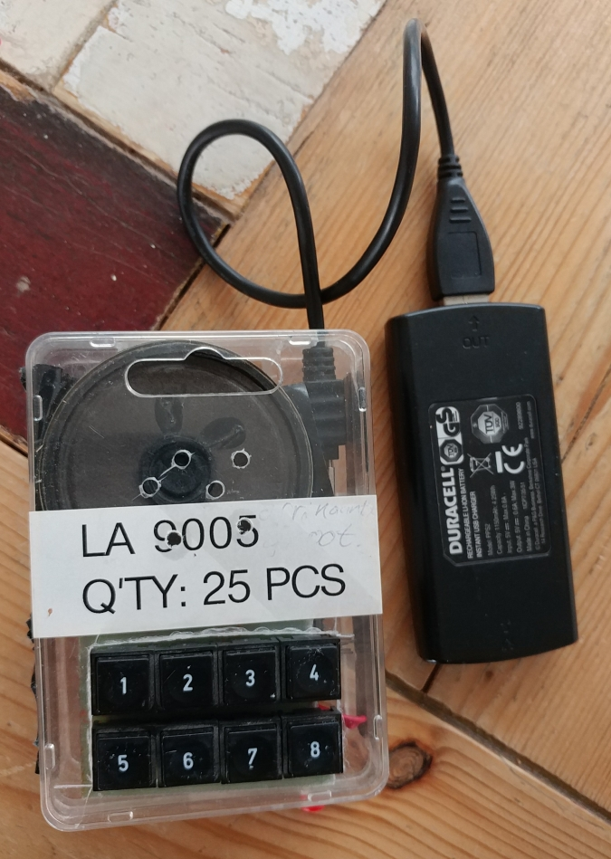
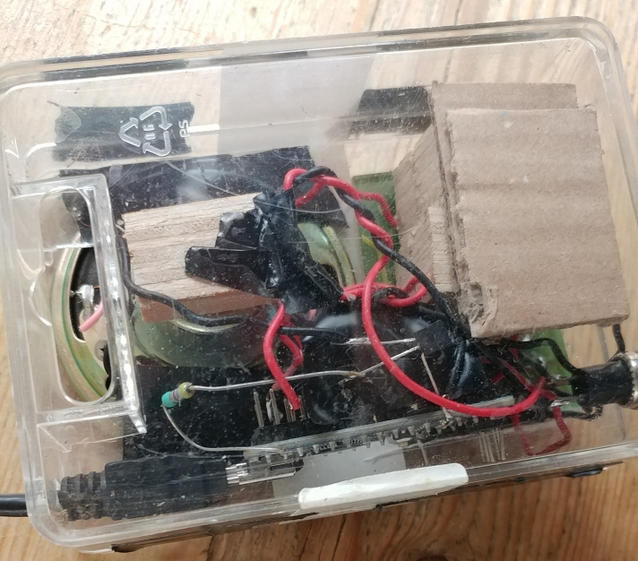
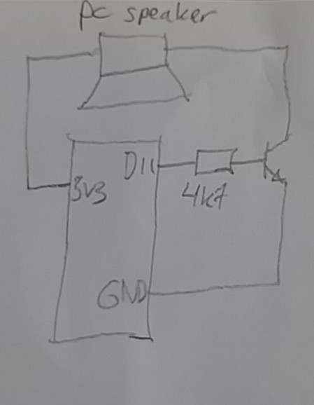

# Arduino children's organ / synthesizer

All of the hard work was done in
[this project](https://create.arduino.cc/projecthub/michalin70/arduino-as-waveform-synthesizer-for-music-2aa48f).
The concept of the 1-T amplifier is explained [here](https://github.com/earlephilhower/ESP8266Audio).
And then I did a little work to create a children's organ / synth from it.

It has two voices, and aims to be parent-friendly (= not too loud). A video of the toy in action
can be found [here](https://player.vimeo.com/video/697678995).

## Schematic

[The original project](https://create.arduino.cc/projecthub/michalin70/arduino-as-waveform-synthesizer-for-music-2aa48f) has a fancy amplifier/filter end stage. You can build that for proper sound.
However, I wanted to try if I could build something with minimal components that I already had.
A PC speaker seems to work well. The inertia of the speaker does some poor man's filtering.
The transistor can be a regular NPN, for example a BC550.

All the buttons are connected to the D*nn*-ports and ground. You can choose to connect the
speaker to 5V instead of 3V3 for louder sound.

Disclaimer: the speaker may run a bit out of specifications. Don't blame me if it blows up...

## The code

After my changes, it doesn't win the beauty or clean code prize. However, it does work.
With the 1-T amplifier, only the square and triangle waves sounded well; I couldn't get
the sine to work. For this you probably need to build a proper amplifier/filter stage.
The first voice has a regular scale (CDEFGABC), the second voice is pentatonic
(CDEGACDE if I remember correctly), fitting well with a guitarish sound.

# License
This work (as was the original) is licensed under the Creative Commons Attribution-ShareAlike 4.0 International License.
To view a copy of this license, visit https://creativecommons.org/licenses/by-sa/4.0/deed.en